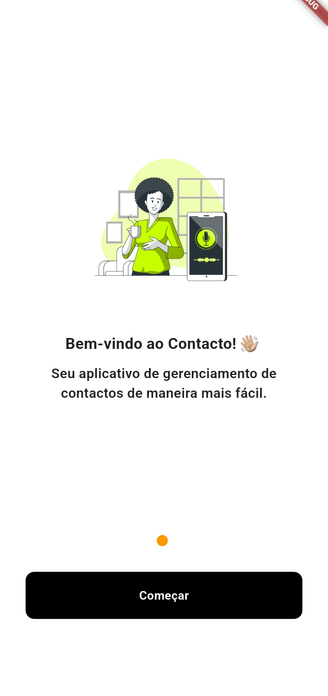
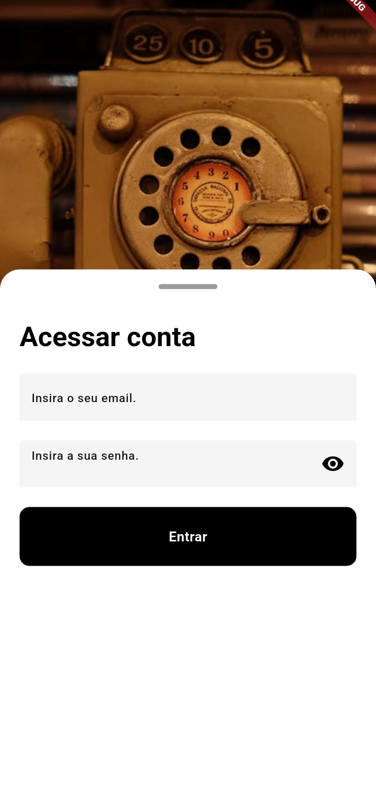
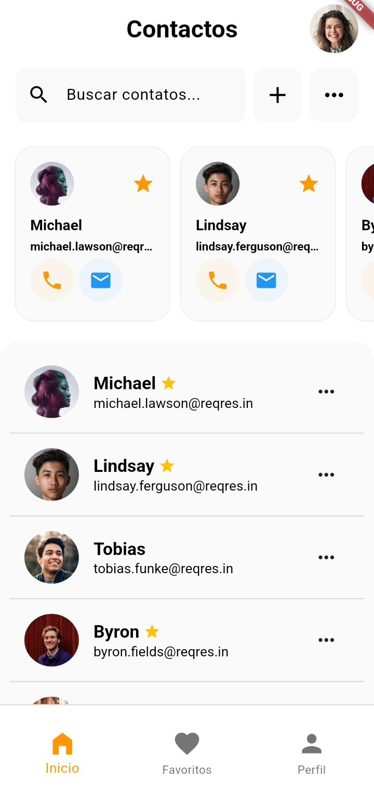
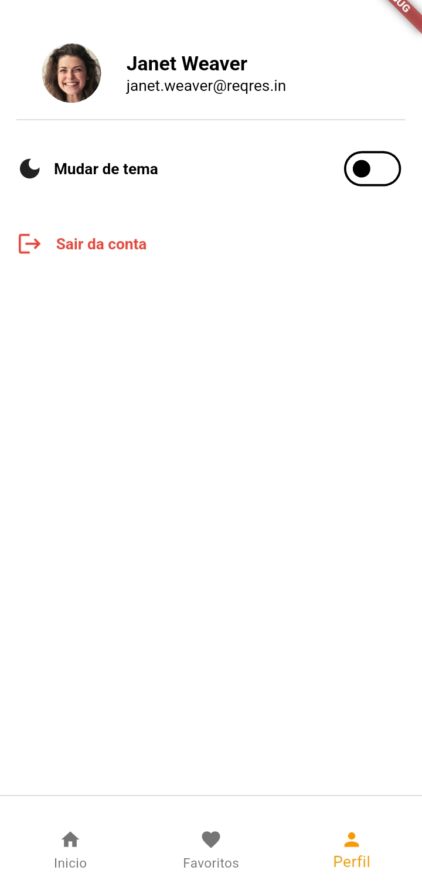
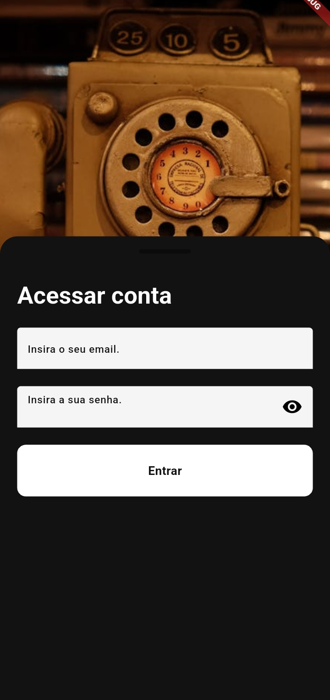
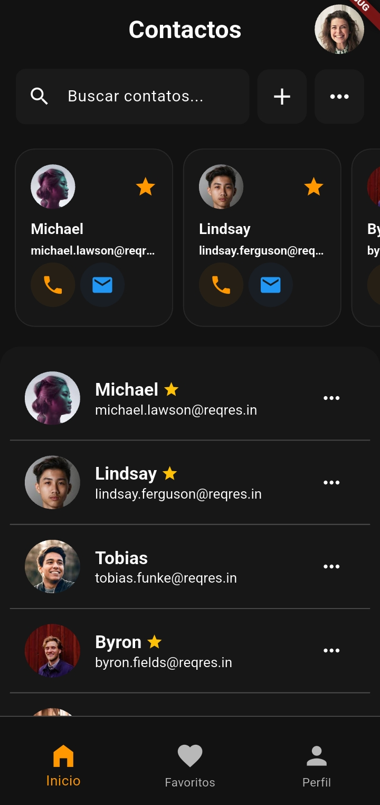
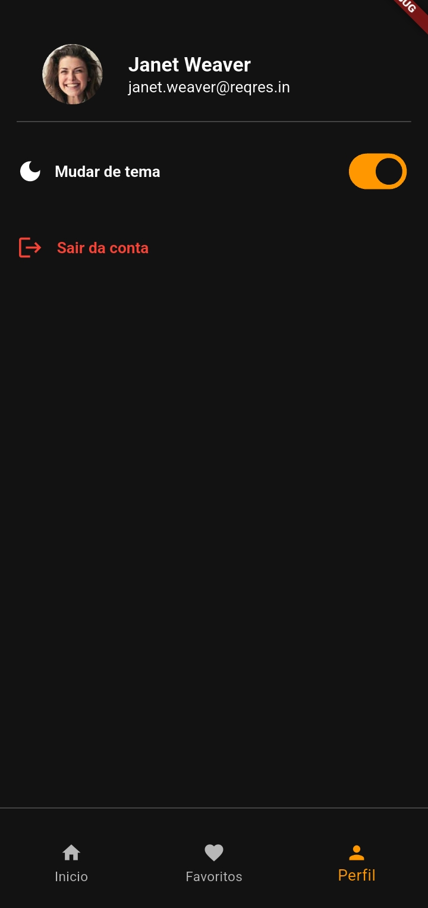

# 📱 Contactos App

Aplicativo de contatos simples com autenticação, modo claro/escuro e persistência local. Construído com Flutter usando arquitetura limpa (Clean Architecture) e gerenciamento de estado com Cubit (Bloc).

---

## Contas de login

##### Email: ``eve.holt@reqres.in``
##### Email: `cityslicka`

---

## 🖼️ Screenshots
#### 🖼️ Light Mode

| Board | Login | Home | Perfil |
|-------|------|--------|--------|
|  |  |  |  |


## 🖼️ Screenshots
#### 🖼️ Dark Mode

| Board | Login | Home | Perfil |
|-------|------|--------|--------|
|  |  |  |  
---

## ✨ Funcionalidades

- ✅ Autenticação com API e persistência local.
- ✅ Busca de contatos com interface responsiva.
- ✅ Exibição do avatar e nome do usuário logado.
- ✅ Alternância de tema claro/escuro com salvamento local.
- ✅ Logout e limpeza de sessão.
- ✅ Arquitetura limpa com camadas `data`, `domain`, e `presentation`.

---

## 🛠️ Tecnologias utilizadas

- [Flutter](https://flutter.dev/)
- [Bloc & Cubit](https://pub.dev/packages/flutter_bloc)
- [Shared Preferences](https://pub.dev/packages/shared_preferences)
- [Sqflite (se aplicável)](https://pub.dev/packages/sqflite)
- Clean Architecture
- Injeção de dependência com `get_it`

---

## 🧱 Estrutura do projeto

lib/
├── core/
│ ├── theme/
│ └── utils/
├── data/
│ └── repositories/
├── domain/
│ └── usecases/
├── presentation/
│ ├── cubits/
│ ├── screens/
│ └── widgets/
└── main.dart

---

## 🚀 Como executar

```bash
# 1. Clone o repositório
git clone https://github.com/seu-usuario/biscato-app.git

# 2. Acesse a pasta
cd biscato-app

# 3. Instale as dependências
flutter pub get

# 4. Execute o app
flutter run
